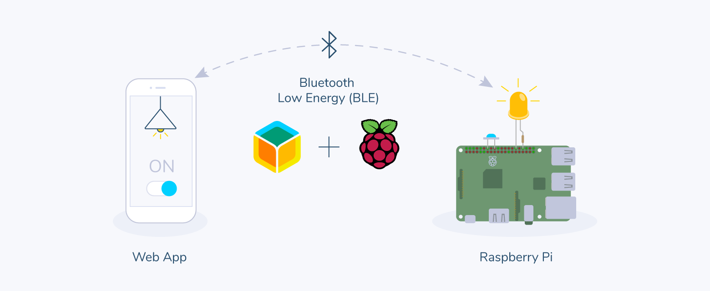

# vac_laser_test

Digital Prototype

# Bluetooth Control Options as of 13/11/20
## bluetooth serial port on raspbian lite

outline:

>pair bluetooth > serial port > issue command to run script > pin driven high > relay activate 

status: working, possible compatibility issues with apple iOS and ionic framework

## nodejs "bleno" gatt-server on raspbian lite

https://github.com/abandonware/bleno - bleno BLE peripheral on nodejs
https://github.com/abandonware/noble - noble BLE central module nodejs
outline:

>sudo npm install bleno

status: Bleno is an actively maintained & functioning javascript library for creating BLE peripherals, probably the best all round option for function and compatibility. Working.

## python ble gatt-server on raspbian lite

https://github.com/jakka351/boxee gpio control over ble example

outline:

>Creates a Bluetooth LE advertisement and publishes one service,which sets GPIO 17 and 18 to HIGH and LOW on a Raspberry PI, by writing a 2 byte value array:

    0x00 0x00 => PIN 17 and 18 is LOW
    0x00 0xFF => PIN 17 is LOW, PIN 18 is HIGH
    0xFF 0xFF => PIN 17 and 18 are HIGH

>Boxee is a Bluetooth Low Energy automation protoype for the Raspberyy PI. It relies on Dbus and Bluez to expose GPIO control over the BLE, so that one can >control GPIOs over the phone. The testing application on IOS is LightBlue

status: not working, dbus-org.bluez error, looks good if can get running, unsure of compatibility with ionic

## balena.io ble docker container application on balenaOS

outline:

This project uses the Web Bluetooth API and balena to control Bluetooth Low Energy (BLE) devices remotely from a browser.

>embedded linux device operating system running single container ble application, web interface for management of application & devices, is a paid service and ownership of app, production level OS with better security than RPI Raspbian.

status: working, requires $$$ fee for service & modification of code, unsure of compatibility with ionic

   https://learn.adafruit.com/introduction-to-bluetooth-low-energy/gatt ble intro
   
   https://github.com/jakka351/raspberrypi-ble-server another example
   
   https://gist.github.com/stonehippo/d56d626927d0d4d137428341ac95b87b another example
   
   https://www.slideshare.net/yeokm1/introduction-to-bluetooth-low-energy background info
   
   https://raspberry-valley.azurewebsites.net/Securing-Raspberry-Pi/
   
   https://github.com/abandonware/node-bluetooth-hci-socket/tree/master/examples
   
   https://github.com/abandonware/node-eddystone-beacon-scanner
   
   
Test rig

jack contact details +61434645485 bjakkaleighton@gmail.com 

**Dri-Sump Containment Tightness Testing Brainstorm**

                Negative Pressure Vacuum Test
                -view chamber results -> see laser dot = pass
                -----------------------> see laser line = fail
               
                
**22/10/2020 - rpi to have own gps unit**
   
   **read only file system to help avoid sd card corruption **           

   **~~22/10/2020 - Bluetooth Serial out**

   **Phone App Details**

Ionic Framework - lightweight front-end (static HTML, CSS and light Javascript – with no CMS) 

Offline mode 
           
            Using AWS AppSync in conjunction with datastore, technicians and engineers will have the
            ability to work offline enabling the application to work in remote areas where internet access is
            limited. The data they collect will be stored locally and then once an internet connection is
            established, the data will sync to the cloud. In addition, AWS SNS will send a push notification
            to the user's device to signify if the data was uploaded successfully when an internet
            connection is established. (Downsides: If it does not upload correctly once a connection is
            established then all the work the engineer conducted offline would go unrecorded)"

